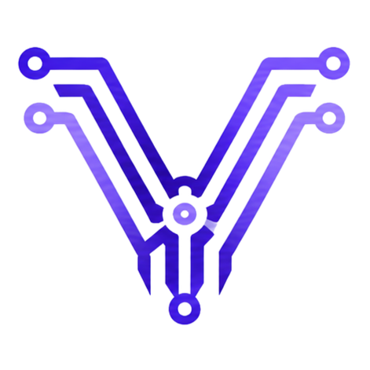
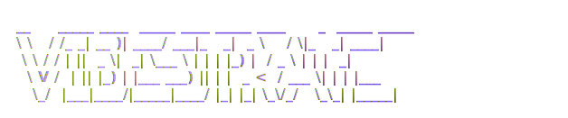

<a name="top"></a>

<div align="center">





<sub>the missing piece of vibe-coding</sub>

<br />

<sub><b>a local-first supervisor for the coding agents already on your machine</b></sub>

<br />

One chat with one model is great for sketches.
Real work - refactors, migrations, whole features - wants a *supervised* crew.
Vibestrate runs the coding-agent CLIs you already have through a visible **plan → build → review → verify** loop, in an isolated git worktree, **entirely on your machine.** It finds those CLIs for you, wires them up in one command, and never asks for a key.

<br />

[](./LICENSE)
[](https://www.npmjs.com/package/vibestrate)
[](https://www.npmjs.com/package/vibestrate)
[](https://github.com/guyshonshon/vibestrate/stargazers)
[](https://nodejs.org)
[](https://www.typescriptlang.org)
[](#-contributing)

<br />

[](https://vibestrate.shonshon.com)
[](https://vibestrate.shonshon.com/docs)
[](#-quick-start)
[](https://github.com/guyshonshon/vibestrate)

</div>

---

<details>
<summary><b>Table of contents</b></summary>

- [Quick start](#-quick-start)
- [Why it exists](#-why-it-exists)
- [What it is](#-what-it-is)
- [Ready in one command](#-ready-in-one-command)
- [Why local-first](#-why-local-first)
- [How a run works](#-how-a-run-works)
- [Full coverage, full control](#-full-coverage-full-control)
- [Documentation](#-documentation)
- [Built with](#-built-with)
- [Contributing](#-contributing)
- [Versioning](#-versioning)
- [License](#-license)

</details>

## ◆ Quick start

Install Vibestrate — the command is `vibe`:

```bash
# macOS / Linux
curl -fsSL https://raw.githubusercontent.com/guyshonshon/vibestrate/main/install.sh | sh

# …or with npm directly
npm install -g vibestrate
```

Then point it at any git repo:

```bash
cd your-project
vibe init                     # scaffold .vibestrate/ - touches nothing else
vibe doctor --fix             # detect providers + project, wire it up
vibe run "Add audit logging to the settings flow"
```

Add `--ui` to any run to open the Mission Control dashboard. New here? [Ready in one command](#-ready-in-one-command) explains what `vibe doctor` detects and wires up for you.

> **Security scanner note:** Some automated scanners have flagged the optional
> Telegram notification gateway as "exfiltration" because the bundled CLI
> contains `fetch`, `api.telegram.org`, and `process.env` references. That is a
> false positive: Vibestrate has no hardcoded Telegram bot token, reads only the
> single `env:NAME` value you configured, and sends only your notification text
> to your own chat. See [SECURITY.md](./SECURITY.md#known-false-positives).

<p align="right"><a href="#top">↑ back to top</a></p>

## ◆ Why it exists

Vibe-coding with a single chat is a high-wire act. It flies for a sketch - then you hit real work and quietly become the babysitter: re-pasting context the model already forgot, catching the confident-but-wrong refactor *before* it lands, squinting at a diff you never watched get made, and losing count of how many tokens (and dollars) five "quick tries" just burned. One model, one point of view, no record, no brakes.

Vibestrate trades the high-wire for an assembly line you can see. Your task walks down a row of specialists - a **planner** sketches the change, an **architect** shapes it, an **executor** writes it in a throwaway git worktree, *your own tests* run as the referee, a **reviewer** (ideally a **different** model, so it doesn't share the executor's blind spots) tears into the diff, a **fixer** answers the findings, and a **verifier** signs off. You watch each handoff. You approve the moments that matter. Every prompt, diff, decision, and token is on the record - and nothing merges until you say so.

That's the whole trick: the work that used to live in your head - the plan, the second opinion, the "did it *actually* pass?", the running cost - becomes visible, ordered, and replayable. Same models you already pay for. Your machine. Your call at every gate.

<p align="right"><a href="#top">↑ back to top</a></p>

## ◆ What it is

Vibestrate is a **local-first supervisor for coding agents** - the review-and-verification layer for the AI CLIs already on your machine. You give it a task in plain language; it spins up a git worktree, walks a **planner → architect → executor → reviewer → verifier** crew through the change, runs *your* validation commands, records every step, and stops at `merge_ready`, `blocked`, or `failed`. It never pushes and never merges - you stay in the chair.

The agents are the CLIs you already have - **Claude Code, Codex, Aider, Ollama, OpenCode** - mix and match per role. Plan with one model, implement with another, review with a third.

<p align="right"><a href="#top">↑ back to top</a></p>

## ◆ Ready in one command

No keys to paste, no YAML to hand-author. Point Vibestrate at a repo and it figures out the rest:

- **Finds your agents.** Detects the coding-agent CLIs already on your machine - **Claude Code, Codex, Aider, Ollama, OpenCode** - wires up the best one, and assigns the whole crew to it.
- **Reads your project.** Detects the language, package manager, and project type, then suggests the real validation commands (typecheck · test · build) it should run as ground truth.
- **Uses logins you already have.** No API key ever lives in Vibestrate; it rides the CLIs you've already authenticated, so prompts and code go straight to those vendors.

**`vibe doctor` is the superpower** - the one command that tells you, in plain language, exactly where you stand, and `--fix` closes the gaps for you:

| `vibe doctor` checks | `vibe doctor --fix` does |
|---|---|
| git present · you're inside a repo | configures the detected provider |
| `.vibestrate/` initialized · config valid | assigns the crew to it |
| project detected (name · type · package manager) | fills validation commands from your project |
| which provider CLIs are installed - and which aren't | restores any missing scaffolding |
| every role points at a real provider, with safe permissions | |
| validation commands are set | |

Green across the board means you're ready to run. Want the dashboard? Add `--ui` to any run:

```bash
vibe run "Tighten retry handling" --ui    # opens Mission Control
```

> Full walkthrough → **[vibestrate.shonshon.com/docs/getting-started/installation](https://vibestrate.shonshon.com/docs/getting-started/installation)**

<p align="right"><a href="#top">↑ back to top</a></p>

## ◆ Why local-first

This is the part that matters, so it gets no asterisks:

| | |
|---|---|
| 🔑 **No APIs of ours** | Vibestrate never holds an API key. It spawns the vendor CLIs you already logged into and reads their output - your prompts and code go straight to those vendors. Vibestrate is not in the middle. |
| 💸 **No payments, ever** | Vibestrate is free. You pay only for the models you choose to run, billed by the vendor, exactly as before. |
| 📡 **No cloud, no telemetry** | Everything runs on your laptop. Nothing phones home. The only network calls are the ones your provider CLIs already make. |
| 🔒 **Your code stays put** | Edits happen in an isolated worktree under your control. No auto-push, no auto-merge. |
| 📖 **Genuinely open source** | Apache-2.0 licensed, all of it. Read it, fork it, run it offline. |

<p align="right"><a href="#top">↑ back to top</a></p>

## ◆ How a run works

Every run executes a **flow** - an ordered recipe of steps, each performed by a role on a provider. A plain `vibe run` runs the built-in **`default` flow**:

```text
plan → architecture → implement → validate → review → fix → verify
                                      ↑                  │
                                      └──── (loops) ─────┘
```

Each step is filled by a named Role with one job, so when something goes wrong you can read exactly where the chain broke. Validation is its own step - it runs the commands in `.vibestrate/project.yml` (your typecheck, tests, build) as ground truth between "I wrote it" and "looks good to me." The review→fix loop repeats until the review passes or hits its bound. Approval gates can pause a run for a human at any step.

A **Flow** declares the **Seats** it needs (planner, implementer, reviewer…); your **Crew** supplies the **Roles** that fill them, each running on a **Profile** (provider + model + power). Higher-stakes work runs a **different flow** through the same engine - for example one where multiple models arbitrate each other:

```bash
vibe run "Refactor provider permissions" --flow quality-arbitration --crew default
# run one step on a stronger Profile without changing the Role:
vibe run "Implement auth crypto" --flow quality-arbitration --step-profile implement=opus-deep
```

Stuck mid-run? **Rewind** instead of restarting - fork a fresh run that reuses the earlier steps and picks up from a chosen stage:

```bash
vibe run "<same task>" --resume-from <runId> --resume-stage executing
```

> [Concepts](https://vibestrate.shonshon.com/docs/concepts/task) · [Task lifecycle](https://vibestrate.shonshon.com/docs/task-lifecycle) · [CLI reference](https://vibestrate.shonshon.com/docs/reference/cli)

<p align="right"><a href="#top">↑ back to top</a></p>

## ◆ Full coverage, full control

Easy to start is only half of it. The trade Vibestrate makes is unusual: maximum convenience *and* maximum visibility. Every run is a glass cockpit, not a chat log.

- **Watch it happen.** Live, token-by-token output from each agent - the same stream you'd see in the terminal, surfaced in the dashboard.
- **Everything on the record.** Plan, architecture, diff, review findings, fix, verification - each phase writes a named artifact you can read, inspect, and replay.
- **Real cost, real tokens.** A per-step and per-run ledger of tokens and dollars, plus a daily **spend cap** that can warn, downgrade the model, or stop the run when you hit it.
- **Validation as referee.** Your own typecheck / tests / build run between "I wrote it" and "looks good," so review stands on ground truth - not vibes.
- **Your call at every gate.** Approval gates pause for a human; nothing pushes, nothing merges. A run ends at `merge_ready`, `blocked`, or `failed` - you decide what lands.
- **Scriptable, on your terms.** The dashboard is backed by a stable HTTP API (versioned `/api/v1`, loopback by default). Drive it from scripts; bind it to the network only behind a bearer token. Share recipes with single-flow import/export (`vibe flows export`/`import`, or the dashboard) - portable because Flows name Seats, not your local crew.

That's the category in one line: Vibestrate is a **supervisor**, not an autopilot.

<p align="right"><a href="#top">↑ back to top</a></p>

## ◆ Documentation

Everything lives at **[vibestrate.shonshon.com/docs](https://vibestrate.shonshon.com/docs)** - getting started, concepts, workflows, troubleshooting, and a source-aware reference for every command, config key, provider, and Flow (generated straight from the code, so it never drifts).

<p align="right"><a href="#top">↑ back to top</a></p>

## ◆ Built with

[](https://www.typescriptlang.org)
[](https://nodejs.org)
[](https://zod.dev)
[](https://fastify.dev)
[](https://react.dev)
[](https://vite.dev)

<p align="right"><a href="#top">↑ back to top</a></p>

## ◆ Contributing

Contributions are genuinely welcome - this is a learning project, and a better one with you in it.

- 🐛 **Found a bug?** [Open an issue](https://github.com/guyshonshon/vibestrate/issues/new/choose) - what you ran, what happened, and the `runId` if you have one.
- 🔐 **Security concern?** Please **don't** open a public issue - see [SECURITY.md](./SECURITY.md) for private disclosure.
- ✨ **Want to build something?** Features come in as **pull requests** - that's the path we encourage most. A quick issue first to sketch the idea is welcome but optional. See [CONTRIBUTING.md](./CONTRIBUTING.md).

Run the checks before you push:

```bash
pnpm install && pnpm typecheck && pnpm test && pnpm build
```

<p align="right"><a href="#top">↑ back to top</a></p>

## ◆ Versioning

Vibestrate follows [SemVer](https://semver.org). We're pre-1.0 (`0.x`) - the surface is real and tested, but minor versions may still carry breaking changes. The version lives in [`package.json`](./package.json) only, and flows into `vibe --version` and the generated docs reference.

## ◆ License

Distributed under the [Apache License 2.0](./LICENSE). Use it, fork it, ship it.

---

<div align="center">

Built with care by **[Guy Shonshon](https://shonshon.com)**

<a href="https://shonshon.com">
  
</a>

</div>
