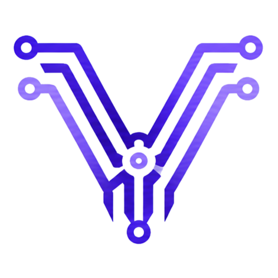
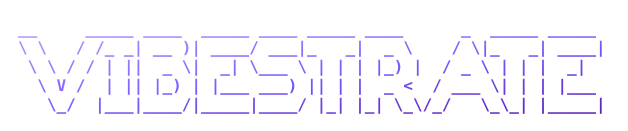
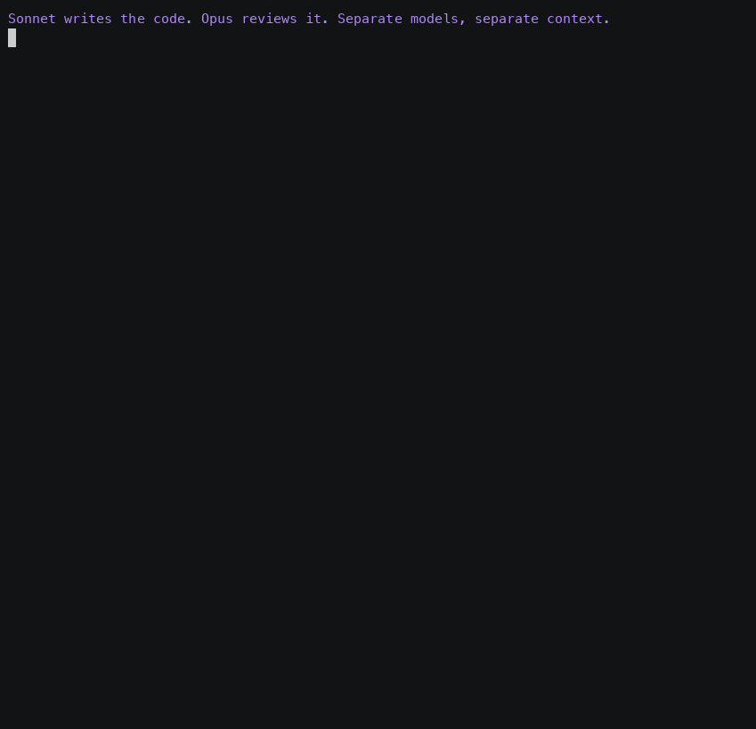

<a name="top"></a>

<div align="center">





<sub>the missing piece of vibe-coding</sub>

<br />

<sub><a href="https://www.npmjs.com/package/vibestrate"></a> <b>(BETA)</b></sub>

<br />

One chat with one model is great for sketches.
Real work - refactors, migrations, whole features - wants a supervised flow you can stay inside.
Vibestrate is an open-source, supervised flow for AI coding: choose or share a flow, fill the crew with Claude Code, Codex, Gemini, Aider, OpenCode, or local models, approve the risky gates yourself, and keep the run ledger on your machine. If one model becomes unavailable, unreliable, or overpriced, swap the crew without changing the flow.

<br />



<sub>A real run. Sonnet wrote the code and its tests; Opus reviewed the diff and found a crash on negative totals that the passing tests never reached.<br />
Too fast to follow? <code>.github/assets/demo.cast</code> is the raw recording, and
<code>docs/demo-player.html</code> replays it with pause, scrub and speed control.</sub>

<br />

[](./LICENSE)
[](https://www.npmjs.com/package/vibestrate)
[](https://www.npmjs.com/package/vibestrate)
[](https://github.com/guyshonshon/vibestrate/stargazers)
[](https://nodejs.org)
[](https://www.typescriptlang.org)
[](#-contributing)

<br />

[](https://vibestrate.com)
[](https://vibestrate.com/docs)
[](#-quick-start)
[](https://github.com/guyshonshon/vibestrate)

</div>

---

<details>
<summary><b>Table of contents</b></summary>

- [Quick start](#-quick-start)
- [Why it exists](#-why-it-exists)
- [What it is](#-what-it-is)
- [Ready in one command](#-ready-in-one-command)
- [Why local-first](#-why-local-first)
- [How a run works](#-how-a-run-works)
- [Rules, not suggestions](#-rules-not-suggestions)
- [Full coverage, full control](#-full-coverage-full-control)
- [Documentation](#-documentation)
- [Built with](#-built-with)
- [Contributing](#-contributing)
- [Versioning](#-versioning)
- [License](#-license)

</details>

## ◆ Quick start

Install Vibestrate - the command is `vibe`:

```bash
# macOS / Linux
curl -fsSL https://raw.githubusercontent.com/guyshonshon/vibestrate/main/install.sh | sh

# …or with npm directly (macOS, Linux, or Windows)
npm install -g vibestrate
```

> The `-g` matters. Vibestrate is a command-line tool, not a library: a plain
> `npm install vibestrate` adds it as a dependency of whatever project you are
> standing in and never puts `vibe` on your PATH. Nothing is published for you
> to `import`.

Vibestrate runs natively on macOS, Linux, and **Windows** - the full core loop (install, providers, runs, diffs, merge) works in PowerShell or cmd with no WSL. The one Windows-only exception is the in-app terminal tab; use WSL if you want an in-app shell. Details: [Native Windows support](https://vibestrate.com/docs/getting-started/windows).

Then point it at any git repo:

```bash
cd your-project
vibe init                     # scaffold .vibestrate/ - touches nothing else
vibe doctor --fix             # detect providers + project, wire it up
vibe run "Add audit logging to the settings flow"
```

Add `--ui` to any run to open the Mission Control dashboard. New here? [Ready in one command](#-ready-in-one-command) explains what `vibe doctor` detects and wires up for you.

<p align="right"><a href="#top">↑ back to top</a></p>

## ◆ Why it exists

Vibe-coding with a single chat is a high-wire act. It flies for a sketch - then you hit real work and quietly become the babysitter: re-pasting context the model already forgot, catching the confident-but-wrong refactor *before* it lands, squinting at a diff you never watched get made, and losing count of how many tokens (and dollars) five "quick tries" just burned. One model, one point of view, no record, no brakes.

Vibestrate trades the high-wire for an assembly line you can see. Your task walks down a row of specialists - a **planner** sketches the change, an **architect** shapes it, an **executor** writes it in a throwaway git worktree, *your own tests* run as the referee, a **reviewer** (ideally a **different** model, so it doesn't share the executor's blind spots) tears into the diff, a **fixer** answers the findings, and a **verifier** signs off. You watch each handoff. You approve the moments that matter. Every prompt, diff, decision, and token is on the record - and nothing merges until you say so.

That's the whole trick: the work that used to live in your head - the plan, the second opinion, the "did it *actually* pass?", the running cost - becomes visible, ordered, and replayable. Same models you already pay for. Your machine. Your call at every gate.

<p align="right"><a href="#top">↑ back to top</a></p>

## ◆ What it is

Vibestrate is a **local-first supervisor for coding agents** - the review-and-verification layer for the AI CLIs already on your machine. You give it a task in plain language; it spins up a git worktree, walks a **planner → architect → executor → reviewer → verifier** crew through the change, runs *your* validation commands, records every step, and stops at `merge_ready`, `blocked`, or `failed`. It never pushes and never merges - you stay in the chair.

The agents are the CLIs you already have - **Claude Code, Codex, Aider, Ollama, OpenCode** - mix and match per role. Plan with one model, implement with another, review with a third.

<p align="right"><a href="#top">↑ back to top</a></p>

## ◆ Ready in one command

No keys to paste, no YAML to hand-author. Point Vibestrate at a repo and it figures out the rest:

- **Finds your agents.** Detects the coding-agent CLIs already on your machine - **Claude Code, Codex, Aider, Ollama, OpenCode** - wires up the best one, and assigns the whole crew to it.
- **Reads your project.** Detects the language, package manager, and project type, then suggests the real validation commands (typecheck · test · build) it should run as ground truth.
- **Uses logins you already have.** No API key ever lives in Vibestrate; it rides the CLIs you've already authenticated, so prompts and code go straight to those vendors.

**`vibe doctor` is the superpower** - the one command that tells you, in plain language, exactly where you stand, and `--fix` closes the gaps for you:

| `vibe doctor` checks | `vibe doctor --fix` does |
|---|---|
| git present · you're inside a repo | configures the detected provider |
| `.vibestrate/` initialized · config valid | assigns the crew to it |
| project detected (name · type · package manager) | fills validation commands from your project |
| which provider CLIs are installed - and which aren't | restores any missing scaffolding |
| every role points at a real provider, with safe permissions | |
| validation commands are set | |

Green across the board means you're ready to run. Want the dashboard? Add `--ui` to any run:

```bash
vibe run "Tighten retry handling" --ui    # opens Mission Control
```

> Full walkthrough → **[vibestrate.com/docs/getting-started/installation](https://vibestrate.com/docs/getting-started/installation)**

<p align="right"><a href="#top">↑ back to top</a></p>

## ◆ Why local-first

This is the part that matters, so it gets no asterisks:

| | |
|---|---|
| 🔑 **No APIs of ours** | Vibestrate never holds an API key. It spawns the vendor CLIs you already logged into and reads their output - your prompts and code go straight to those vendors. Vibestrate is not in the middle. |
| 💸 **No payments, ever** | Vibestrate is free. You pay only for the models you choose to run, billed by the vendor, exactly as before. |
| 📡 **No cloud, no telemetry** | Everything runs on your laptop. Nothing phones home. The only network calls are the ones your provider CLIs already make. |
| 🔒 **Your code stays put** | Edits happen in an isolated worktree under your control. No auto-push, no auto-merge. |
| 📖 **Genuinely open source** | Apache-2.0 licensed, all of it. Read it, fork it, run it offline. |

<p align="right"><a href="#top">↑ back to top</a></p>

## ◆ How a run works

Every run executes a **flow** - an ordered recipe of steps, each performed by a role on a provider. A plain `vibe run` runs the built-in **`default` flow**:

```text
plan → architecture → implement → validate → review → fix → verify
                                      ↑                  │
                                      └──── (loops) ─────┘
```

Each step is filled by a named Role with one job, so when something goes wrong you can read exactly where the chain broke. Validation is its own step - it runs the commands in `.vibestrate/project.yml` (your typecheck, tests, build) as ground truth between "I wrote it" and "looks good to me." The review→fix loop repeats until the review passes or hits its bound. Approval gates can pause a run for a human at any step.

A **Flow** declares the **Seats** it needs (planner, implementer, reviewer…); your **Crew** supplies the **Roles** that fill them, each running on a **Profile** (provider + model + power). Higher-stakes work runs a **different flow** through the same engine - for example one where multiple models arbitrate each other:

```bash
vibe run "Refactor provider permissions" --flow quality-arbitration --crew default
# run one step on a stronger Profile without changing the Role:
vibe run "Implement auth crypto" --flow quality-arbitration --step-profile implement=opus-deep
```

Stuck mid-run? **Rewind** instead of restarting - fork a fresh run that reuses the earlier steps and picks up from a chosen stage:

```bash
vibe run "<same task>" --resume-from <runId> --resume-stage executing
```

> [Concepts](https://vibestrate.com/docs/concepts/task) · [Task lifecycle](https://vibestrate.com/docs/task-lifecycle) · [CLI reference](https://vibestrate.com/docs/reference/cli)

<p align="right"><a href="#top">↑ back to top</a></p>

## ◆ Rules, not suggestions

Telling a model "stop using em-dashes" works right up until the run where it doesn't. You can't audit an instruction the model merely *agreed* to. So write the rule down once, at the project level, and every run gets checked against it - whichever supervisor is on duty, whichever model is in the chair.

```bash
vibe policies add no-em-dash "do not use em-dash characters" --fix "use a hyphen"
vibe policies add no-eyebrow "no eyebrow labels" --block --matcher "SectionEyebrow"
vibe policies list
```

Two tiers, and the difference between them is the whole point:

| Tier | How it's enforced | What it's for |
|---|---|---|
| **advise** | The reviewer reads your rule alongside the diff. A violation is flagged and rides the normal review → fix loop, same as a correctness note. | Judgment calls - "no eyebrow labels", "match our design language", "don't over-engineer this". A model catches the paraphrase a regex would miss. |
| **block** | A regex over the run's changed lines. Match, and the run lands `blocked` with the reason shown - **even if the reviewer approved it**. | Rules with a shape you can name. It's not a model verdict, so it can't be reasoned with, softened, or forgotten. |

Here's the part that matters: **a block is owner-only.** The supervisor can *propose* a rule from a consult, but that path is hard-constrained to `advise`, and the proposal sits pending doing nothing until you confirm it. **A model can never author its own hard merge-cap.** The gate scans from the run's fork point (so mid-run commits are caught), skips secret-shaped files, and fails closed - if it can't read the diff, it blocks rather than waving the change through.

The dashboard **Policies** page does all of it too: create either tier, confirm or reject what the supervisor proposed, remove. And a plain `vibe run` needs zero policies - this is an additive layer, not a tax.

> [Policies](https://vibestrate.com/docs/concepts/policies) · [CLI reference](https://vibestrate.com/docs/reference/cli)

<p align="right"><a href="#top">↑ back to top</a></p>

## ◆ Full coverage, full control

Easy to start is only half of it. The trade Vibestrate makes is unusual: maximum convenience *and* maximum visibility. Every run is a glass cockpit, not a chat log.

- **Watch it happen.** Live, token-by-token output from each agent - the same stream you'd see in the terminal, surfaced in the dashboard.
- **Everything on the record.** Plan, architecture, diff, review findings, fix, verification - each phase writes a named artifact you can read, inspect, and replay.
- **Real cost, real tokens.** A per-step and per-run ledger of tokens and dollars, plus a daily **spend cap** that can warn, downgrade the model, or stop the run when you hit it.
- **Validation as referee.** Your own typecheck / tests / build run between "I wrote it" and "looks good," so review stands on ground truth - not vibes.
- **Your call at every gate.** Approval gates pause for a human; nothing pushes, nothing merges. A run ends at `merge_ready`, `blocked`, or `failed` - you decide what lands.
- **Merge from a tree you can see.** The dashboard **Git tree** draws your branches as a graph: pick any source and target, *predict* the merge and its conflicts before applying, let the supervisor propose a resolution per conflict (secret-safe - secret-shaped files are never sent to a provider), apply on an explicit click, and undo with one guarded click. Every merge is human-initiated, gated through the Action Broker, `--no-ff`, local, and never pushed.
- **OS sandbox when you want it (off by default).** The worktree, the diff gate, and human-review-before-merge already bound what a run can do, so confinement is opt-in, not a tax on every run. Flip `execution.isolation: sandboxed` for an untrusted task or an unattended run and each turn runs under the provider's own OS sandbox (codex's Apple Seatbelt / Linux Landlock - a write outside the worktree is refused by the OS). A provider without a real sandbox warns once and runs unsandboxed rather than pretending; the run records only what was actually enforced.
- **Cut the network too (off by default).** With the container backend, `execution.container.egress.mode: allowlist` puts the run container on a Docker network with **no gateway** - so there is no route out except an allowlisting proxy that refuses any host you didn't name (the model APIs are allowed out of the box; refusals are logged with the exact host). The enforcement is the missing route, not a `HTTPS_PROXY` variable a hostile turn could ignore, and if the network or proxy can't be created the run is refused rather than quietly running wide open. Honest limit: a TLS tunnel to an allowed host is opaque, so this narrows exfiltration to hosts you chose - it doesn't eliminate it.
- **Limits you can't accidentally lose.** Policies are default-allow with a veto - so the broker is where you *impose* rules, and a rule that silently failed to load would be worse than none. A run refuses to start while any policy file is malformed or a rule id is defined twice (the duplicate is dropped, so your stricter rule would have vanished). `require_approval` is accepted only where something can actually pause, instead of quietly meaning `deny`. And an unattended run with no ceiling and no confinement tells you so before it starts.
- **Ask the orchestrator.** `vibe consult "should this use a heavier review?"` (or the dashboard **Consult** button) answers from your project's real context - config, recent runs, validation evidence, and a committed `VIBESTRATE.md` manual - and is honest about what it could not verify. Read-only: it recommends, it never acts.
- **It learns your codebase, deterministically.** `vibe learn` (also run best-effort by `vibe init`) scans stack, scripts, layout, languages, best-effort HTTP routes, and tooling into a machine-owned, regenerable map (`.vibestrate/CODEBASE.md` + `codebase-map.json` - no model call, secret-redacted, atomic). It grounds the planner and Consult, refreshes itself at run terminal outcomes, and marks itself stale once `HEAD` moves - `vibe learn show` prints it, and the dashboard's Codebase page has a **Map** view with a Refresh action.
- **The Flow is never hidden.** Every run shows `Flow: <name> · <source>`. Pin a default with `vibe flows use <id>`, force one with `--flow`, or let the orchestrator pick for the task with `--select` (it states a confidence + reasons and records why).
- **Fill your project once.** A Flow declares typed `params:` (name, niche, brand color…); Vibestrate remembers your answers as durable **project parameters** and seeds every later run, so you stop re-typing them. `vibe params set` / a `VIBESTRATE_PARAM_*` env var is the clean CI seed (a missing required param fails fast, never hangs); the dashboard form prefills, and an optional **Generate** button can have a provider draft a value you review. Secrets are stored as an `env:NAME` reference, never the raw value - and a run fails fast if that env var is unset.
- **A supervisor with a posture.** The orchestrator ships a default skeptical staff-engineer **persona** (`Supervisor: <name>`, pick per run with `--supervisor` or in the composer; `vibe supervisor list`). It earns its keep, not by tone: a risk-tagged task (auth, payment, migration, secrets…) is deterministically *upgraded* to heavier review and logged - upgrade-only, never softening a gate. Personas are advisory (pinned below every code-enforced gate, no confidence inflation); the run-assurance badge labels review independence honestly (`cross-model` vs same-model `single-profile`).
- **Parallel review when it's worth it.** A Flow can declare a dependency graph; the built-in `panel-review` fans out three read-only reviewers (correctness, tests, security/risk) over the *same* diff at once, then an arbiter joins their findings into one verdict. Parallel steps are hard-enforced read-only (one writer per worktree), bounded, and the fan-out cost is stated up front - never silent.
- **Parallel agents per checklist item.** The graph can also live *inside* the per-item band: the built-in `pickup-analysis` works a card item-by-item, and for each item two read-only analysts (risk/impact + test-surface) study it in parallel before the implementer writes it - "think in parallel, then build", a commit per item. The Flow Builder graph (and `vibe flows show`, and the TUI) show the band and that it repeats per item.
- **Supervised tasks - author a feature as coordinated steps.** A supervised task (`vibe tasks add --supervised`) holds ordered steps, each with a scoped objective, a done-when check, and file hints. Author the full decomposition of a feature in one card, then hand it to the **Conductor** (`vibe tasks run` / `vibe tasks sequence`), which sequences the steps one at a time - each planned, implemented, and reviewed before the next begins, with a between-steps supervisor that can proceed, re-ground the plan, or halt cleanly.
- **Scriptable, on your terms.** The dashboard is backed by a stable HTTP API (versioned `/api/v1`, loopback by default). Drive it from scripts; bind it to the network only behind a bearer token. Share recipes with single-flow import/export (`vibe flows export`/`import`, or the dashboard) - portable because Flows name Seats, not your local crew.

That's the category in one line: Vibestrate is a **supervisor**, not an autopilot.

<p align="right"><a href="#top">↑ back to top</a></p>

## ◆ Documentation

Everything lives at **[vibestrate.com/docs](https://vibestrate.com/docs)** - getting started, concepts, workflows, troubleshooting, and a source-aware reference for every command, config key, provider, and Flow (generated straight from the code, so it never drifts).

<p align="right"><a href="#top">↑ back to top</a></p>

## ◆ Built with

[](https://www.typescriptlang.org)
[](https://nodejs.org)
[](https://zod.dev)
[](https://fastify.dev)
[](https://react.dev)
[](https://vite.dev)

<p align="right"><a href="#top">↑ back to top</a></p>

## ◆ Contributing

Contributions are genuinely welcome - this is a learning project, and a better one with you in it.

- 🐛 **Found a bug?** [Open an issue](https://github.com/guyshonshon/vibestrate/issues/new/choose) - what you ran, what happened, and the `runId` if you have one.
- 🔐 **Security concern?** Please **don't** open a public issue - see [SECURITY.md](./.github/SECURITY.md) for private disclosure.
- ✨ **Want to build something?** Features come in as **pull requests** - that's the path we encourage most. A quick issue first to sketch the idea is welcome but optional. See [CONTRIBUTING.md](./.github/CONTRIBUTING.md).

Run the checks before you push:

```bash
pnpm install && pnpm typecheck && pnpm test && pnpm build
```

<p align="right"><a href="#top">↑ back to top</a></p>

<a name="-beta"></a>

## ◆ Beta

Vibestrate is in beta. Not a disclaimer - a description of which parts have settled and which have not, so you can decide what to build on.

**Settled.** The CLI command names and their flags. The run model: a run works in its own git worktree, stops at merge-ready, and never pushes or merges on its own. Everything stays on your machine - no cloud, no relay, no telemetry. The `.vibestrate/` layout for runs, tasks and events.

**Not settled.** The config schema, and the policy schema in particular - `1.1.5` refused a `require_approval` effect that `1.0.1` accepted at load. Flow and crew YAML. The HTTP surface outside `/api/v1`. Internal modules under `src/` are not an API at all.

**What you get before something breaks.** Every breaking change leads its release notes with the migration, in the words you would need to fix it - see the `1.1.5` entry in [`CHANGELOG.md`](./CHANGELOG.md) for the shape. Loud is the point: a config Vibestrate can no longer honour is refused at load rather than silently ignored, because a rule you believe is holding and never fires is worse than an error.

**If you need it to stop moving,** pin an exact version rather than a caret range:

```json
"vibestrate": "1.1.7"
```

Beta ends when the config and policy schemas go a release cycle without a breaking change and the numbers below start meaning what they say to everyone else.

## ◆ Versioning

Vibestrate versions by the SIZE of the change. A **patch** is ordinary work - a merged branch, a fix, a feature that fits the shape already there. A **minor** is a big change: something that alters how you work with the product. A **major** is a whole new version of Vibestrate, not one breaking edit.

That last part is the deliberate difference from strict [SemVer](https://semver.org): a breaking change does not on its own earn a major here. When one ships, it leads the release notes with its migration - see the `1.1.5` entry in [`CHANGELOG.md`](./CHANGELOG.md) for the shape. Pin an exact version if you need that guarantee rather than a caret range.

The public surface is the CLI commands and their flags, the config schema, and the versioned HTTP API (`/api/v1`). Internal modules under `src/` are not a public API and can change in any release. The version lives in [`package.json`](./package.json) only, and flows into `vibe --version` and the generated docs reference.

## ◆ License

Distributed under the [Apache License 2.0](./LICENSE). Use it, fork it, ship it.

---

<div align="center">

Built with care by **[Guy Shonshon](https://shonshon.com)**

<a href="https://shonshon.com">
  
</a>

</div>
